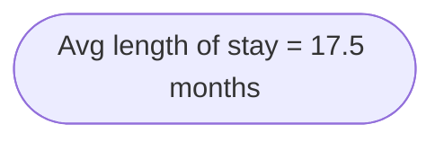
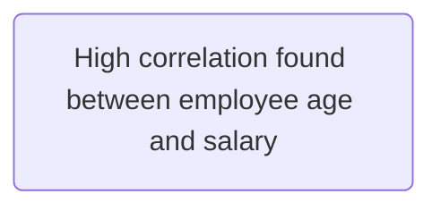

# People-Analytics-Challenge

<details>
  <summary>Code</summary>
  
```
code
```
</details>


Data analysis project developed as part of the People Analytics challenge, promoted by the **[Data Vinking](https://www.dataviking.com.br/)** data community.

Team Members:
- Lucas Pontes *[profile](https://www.linkedin.com/in/lucasdpontes/)*
- Pedro Borges *[profile](https://www.linkedin.com/in/pedrogborges/)*

**Python libraries used:**

     

<br><br><h1 align="center">Intro</h1>

This study conducted analyzes of a Human Resources database to understand the high employee turnover in a company.

Throughout the analysis, different aspects related to the permanence of employees at a Software House company were explored.

Business Pain
- High hiring and resign costs
- Low retention impacts ongoing projects and learning curves
- Training expenses

<br><br><h1 align="center">Analysis</h1>

## Distribution of positions

<details>
  <summary>Code</summary>
  
```
count = df.Nivel_Cargo.value_counts()
perc = df.Nivel_Cargo.value_counts(normalize=True)
pd.concat([count,perc], axis=1, keys=['Valor', 'Percentagem'])
```
</details>

| Position | Percentage |
|:-:|:-:|
| Junior | 35.9  |
| Full | 34.6  |
| Senior | 29.5  |


## Average length of stay

Firstly, the average length of stay of employees was examined, offering an overview of the stability of the workforce over time.

<details>
  <summary>Code</summary>
  
```
df_desligados = df.loc[~df['Data_Desligamento'].isnull()]

tempo_medio_permanencia = round(df_desligados['Meses_de_Servico'].mean(),2)
tempo_medio_permanencia

```
</details>



## Turnover Cycles

Then, turnover cycles were identified, according the chart below, to highlight specific periods in which there were spikes in employee departures from the company.

**according to available data, turnover cycles were analyzed based on the hiring date.*

<details>
  <summary>Code</summary>
  
```
# Variables creation
datas_contratacao = df_desligados['Data_Contratacao'].value_counts().reset_index()
datas_contratacao.columns = ['Data_Contratacao', 'Contagem']

# Sorting date
datas_contratacao = datas_contratacao.sort_values(by=['Data_Contratacao'], ascending=True)

# Plotting
fig = px.line(datas_contratacao, x='Data_Contratacao', y='Contagem', markers = True, title='Histórico de contratações',
              labels={'Data_Contratacao': 'Data de contratação', 'Contagem': 'Quantidade'}, text='Contagem',
              width=800, height=450)
fig.update_traces(textposition='top center')
fig.show()
```
</details>

<br><p align="center"></p>

Based on the hiring history, this value was increased in the 4th quarter of 2023.

In the second quarter of 2024, specifically on March 15, there were 144 layoffs, indicating a **possible mass layoff** scenario.

## Risk profile

In addition, the risk profile of employees was investigated, comparing those who left the company with those who stayed to understand whether higher satisfaction or performance were directly related to these departures.

| | Former employee | Current employee |
|:-:|:-:|:-:|
| **Avg performance (0-5)** | 2.94 | 3.32 |
| **Avg satisfaction (0-5)** | 2.96 | 2.89 |

<br><details>
  <summary>Code</summary>
  
```
# Dataframe creation
data = pd.melt(df.replace({'Desligamento': {0: 'Current employee', 1: 'Former employee'}}), 
               id_vars=['Desligamento'], 
               value_vars=['Satisfacao_Trabalho', 'Pontuacao_Desempenho'],
               var_name='Variavel', value_name='Valor')

data['Variavel'] = data['Variavel'].map({'Satisfacao_Trabalho': 'Satisfaction', 'Pontuacao_Desempenho': 'Performance'})

plt.figure(figsize=(12, 6))

# Combining plotting
sns.boxplot(x='Desligamento', y='Valor', hue='Variavel', data=data, palette='Set3')

# Adjustments
plt.title('Average satisfaction & performance at work')
plt.xlabel('')
plt.ylabel('Score')
plt.legend(title='', loc='best')

# Adding values into boxplots
for tick in plt.gca().get_xticks():
    for i, var in enumerate(['Satisfaction', 'Performance']):
        subset = data[(data['Desligamento'] == data['Desligamento'].unique()[tick]) & (data['Variavel'] == var)]
        values = subset['Valor']
        plt.annotate(f"{values.mean():.2f}", xy=(tick + (i - 0.5) * 0.4, values.mean()), xycoords='data',
                     ha='center', va='center', bbox=dict(boxstyle="round,pad=0.3", fc="white", ec="black"))

plt.show()
```
</details>

<p align="center"></p><br>

<details>
  <summary>Code</summary>

  ```
  # Dataframe creation
data = pd.melt(df.replace({'Desligamento': {0: 'Current employee', 1: 'Former employee'}}),
               id_vars=['Desligamento', 'Nivel_Cargo'],
               value_vars=['Satisfacao_Trabalho'],
               var_name='Variavel', value_name='Valor')

data['Variavel'] = data['Variavel'].map({'Satisfacao_Trabalho': 'Satisfação'})

plt.figure(figsize=(12, 6))

# Combined plotting
sns.boxplot(x='Desligamento', y='Valor', hue='Nivel_Cargo', data=data, palette='Set3')

# Settings
plt.title('Average job satisfaction x Position')
plt.legend(title='Nivel_Cargo', bbox_to_anchor=(1.05, 1), loc='upper left')
plt.tight_layout()
plt.xlabel('')
plt.ylabel('Score')
plt.legend(title='', loc='best')

plt.show()
```
</details>

<p align="center"></p><br>

<details>
  <summary>Code</summary>

  ```
# Dataframe creation
data = pd.melt(df.replace({'Desligamento': {0: 'Current employee', 1: 'Former employee'}}),
               id_vars=['Desligamento', 'Nivel_Cargo'],
               value_vars=['Pontuacao_Desempenho'],
               var_name='Variavel', value_name='Valor')

data['Variavel'] = data['Variavel'].map({'Pontuacao_Desempenho': 'Performance'})

plt.figure(figsize=(12, 6))

# Combined plotting
sns.boxplot(x='Desligamento', y='Valor', hue='Nivel_Cargo', data=data, palette='Set3')

# Settings
plt.title('Average job performance x Position')
plt.legend(title='Nivel_Cargo', bbox_to_anchor=(1.05, 1), loc='upper left')
plt.tight_layout()
plt.xlabel('')
plt.ylabel('Score')
plt.legend(title='', loc='best')

plt.show()
```
</details>

<p align="center"></p><br>


<details>
  <summary>Code</summary>

  ```
# Dataframe creation
data = pd.melt(df.replace({'Desligamento': {0: 'Current employee', 1: 'Former employee'}}),
               id_vars=['Desligamento', 'Nivel_Cargo'],
               value_vars=['Salario'],
               var_name='Variavel', value_name='Valor')


plt.figure(figsize=(12, 6))

# Combined plotting
sns.boxplot(x='Desligamento', y='Valor', hue='Nivel_Cargo', data=data, palette='Set3')

# Settings
plt.title('Salary x Position')
plt.legend(title='Nivel_Cargo', bbox_to_anchor=(1.05, 1), loc='upper left')
plt.tight_layout()
plt.xlabel('')
plt.ylabel('Value')
plt.legend(title='', loc='best')

plt.show()
```
</details>

<p align="center"></p><br>

According to the boxplot views above:
- There is no significant difference between the salaries of former and current employees, regardless of position;
- Also regardless of position, people with higher performance are formers;
- Senior people with lower satisfaction tend to leave their jobs, probably because they found better opportunities.

## Correlations

Statistical analyzes were also carried out to identify correlations between the variables in the database, seeking to better understand the factors underlying high turnover.



<details>
  <summary>Code</summary>

```
sns.heatmap(df.select_dtypes(include=['number']).corr(), annot=True, linewidth=.5, fmt=".2f", cmap="crest")
```
</details>

<p align="center"></p>

## Employees with 2+ years at the company

Finally, employees with up to 2 years at the company were compared with those with 2+ years, seeking to identify possible discrepancies that could provide additional insights about retention.

<details>
  <summary>Code</summary>
  
```
# Flag for employees over 2 years old
df['Mais_de_2_anos'] = 0
df.loc[df['Meses_de_Servico'] > 24, 'Mais_de_2_anos'] = 1

# Dataset creation
data = pd.melt(df.replace({'Mais_de_2_anos': {0: 'until 2 yrs', 1: 'more than 2 yrs'}}),
               id_vars=['Desligamento', 'Nivel_Cargo', 'Mais_de_2_anos'],
               value_vars=['Salario'],
               var_name='Variavel', value_name='Valor')

sns.barplot(data, x='Nivel_Cargo', y='Valor', hue='Mais_de_2_anos', errorbar=None, palette='tab10')

# Settings
plt.title('Average salary x Position')
plt.legend(title='', bbox_to_anchor=(1.05, 1), loc='upper left')
plt.tight_layout()
plt.xlabel('')
plt.ylabel('Average salary')
plt.legend(title='', loc='best')
```
</details>

<p align="center"></p><br>

<details>
  <summary>Code</summary>
  
```
# Dataframe creation
data = pd.melt(df.replace({'Mais_de_2_anos': {0: 'until 2 yrs', 1: 'more than 2 yrs'}}),
               id_vars=['Mais_de_2_anos'],
               value_vars=['Meses_de_Servico'],
               var_name='Variavel', value_name='Valor')

plt.figure(figsize=(6, 5))

# Plotting
sns.boxplot(x='Mais_de_2_anos', y='Valor', hue='Mais_de_2_anos', data=data, palette='Set3')

# Comparation line
plt.axhline(24, color='gray', linestyle='--', linewidth=1)
plt.text(0.4, 23.7, f'2 yrs', color='gray', ha='left', va='top', fontsize=10, fontweight='normal')

# Settings
plt.title('Profile x Months of service')
plt.tight_layout()
plt.xlabel('')
plt.ylabel('')

plt.show()
```
</details>

<p align="center"></p><br>

<details>
  <summary>Code</summary>
  
```
# Plotting
sns.histplot(data=df.replace({'Mais_de_2_anos': {0: 'until 2 yrs', 1: 'more than 2 yrs'}}), x='Meses_de_Servico', hue='Mais_de_2_anos', multiple='stack', palette='Set2')

# Comparation line
plt.axvline(24, color='gray', linestyle='--', linewidth=1)
plt.text(24.2, 75, f'2 yrs', color='gray', ha='left', va='top', fontsize=10, fontweight='normal', rotation=90)

# Settings
plt.title('Profile x Months of service - histogram')
plt.xlabel('Months of service')
plt.ylabel('Count')
plt.legend(title='')
plt.tight_layout()
```
</details>

<p align="center"></p><br>

<details>
  <summary>Code</summary>
  
```

```
</details>

<p align="center"></p><br>


<br><br><h1 align="center">Conclusions</h1>

Após analisar o perfil dos funcionários desligados e não desligados, observamos que todos os funcionários foram desligados no mesmo dia, sugerindo uma ação coletiva ou uma decisão organizacional em massa. Além disso, constatamos que a satisfação média dos funcionários desligados era significativamente menor do que a dos funcionários não desligados, indicando uma possível relação entre insatisfação e saída da empresa.

Surpreendentemente, descobrimos que o desempenho dos funcionários desligados era, em média, maior do que o dos funcionários não desligados. Isso pode sugerir que outros fatores, além do desempenho no trabalho, estão contribuindo para a rotatividade de pessoal, como questões de cultura organizacional, falta de oportunidades de crescimento ou desalinhamento de expectativas.

Essas descobertas ressaltam a importância de uma abordagem multidisciplinar para a retenção de talentos, que leve em consideração não apenas o desempenho individual, mas também o engajamento, a satisfação e o bem-estar dos funcionários. Ao abordar esses aspectos, as organizações podem criar um ambiente de trabalho mais positivo e motivador, reduzindo assim a rotatividade de funcionários e promovendo a retenção de talentos de forma eficaz.
