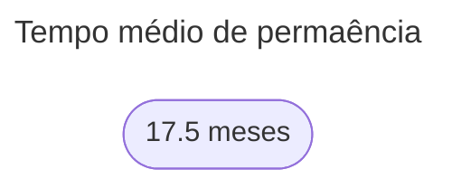
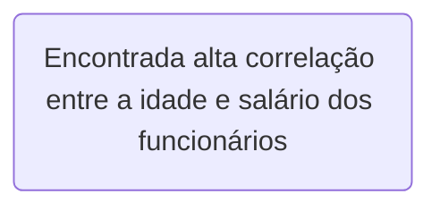

# People-Analytics-Challenge

Projeto desenvolvido como participação do desafio People Analytics, promovido pela comunidade de dados **Data Vinking**.

Team Members:
- Lucas Pontes *[profile](https://www.linkedin.com/in/lucasdpontes/)*
- Pedro Borges: https*[profile](https://www.linkedin.com/in/pedrogborges/)*

  <h1 align="center">Introdução</h1>

Este estudo analisa uma base de dados de Recursos Humanos para compreender a alta rotatividade de funcionários em uma empresa. Ao longo da análise, exploramos diferentes aspectos relacionados à permanência dos funcionários na empresa.

Dor do Negócio
- Altos custos de contratação e desligamento
- Baixa retenção impacta nos projetos em andamento e altas curvas de aprendizado
- Gastos com treinamentos

  <h1 align="center">Análises</h1>

## Tempo médio de permanência

Primeiramente, examinamos o tempo médio de permanência dos colaboradores, oferecendo uma visão geral da estabilidade do quadro de funcionários ao longo do tempo.

## Ciclos de rotatividade

Em seguida, identificamos ciclos de rotatividade, destacando períodos específicos em que ocorreram picos de saída de funcionários.

 

Com base no histórico de contratações, houve uma alta desse valor no 4º trimestre de 2023.
No segundo trimestre desse ano, especificamente em 14/05/2024, houveram 144 desligamentos, indicando um possível cenário de Layoff.

## Perfil de risco

Além disso, investigamos o perfil de risco dos funcionários, comparando funcionários desligados com os não desligados para entender se alta satisfação ou alto desempenho estavam diretamente relacionados a esses desligamentos.

## Correlations

Também realizamos análises estatísticas para identificar correlações entre as variáveis da base de dados, buscando compreender melhor os fatores subjacentes à alta rotatividade.

## Funcionários com 02 anos

Por fim, comparamos os funcionários com até 2 anos de empresa e aqueles com mais de 2 anos, buscamos identificar possíveis discrepâncias que possam fornecer insights adicionais sobre a retenção de talentos.

  <h1 align="center">Conclusões</h1>

Após analisar o perfil dos funcionários desligados e não desligados, observamos que todos os funcionários foram desligados no mesmo dia, sugerindo uma ação coletiva ou uma decisão organizacional em massa. Além disso, constatamos que a satisfação média dos funcionários desligados era significativamente menor do que a dos funcionários não desligados, indicando uma possível relação entre insatisfação e saída da empresa.

Surpreendentemente, descobrimos que o desempenho dos funcionários desligados era, em média, maior do que o dos funcionários não desligados. Isso pode sugerir que outros fatores, além do desempenho no trabalho, estão contribuindo para a rotatividade de pessoal, como questões de cultura organizacional, falta de oportunidades de crescimento ou desalinhamento de expectativas.

Essas descobertas ressaltam a importância de uma abordagem multidisciplinar para a retenção de talentos, que leve em consideração não apenas o desempenho individual, mas também o engajamento, a satisfação e o bem-estar dos funcionários. Ao abordar esses aspectos, as organizações podem criar um ambiente de trabalho mais positivo e motivador, reduzindo assim a rotatividade de funcionários e promovendo a retenção de talentos de forma eficaz.
